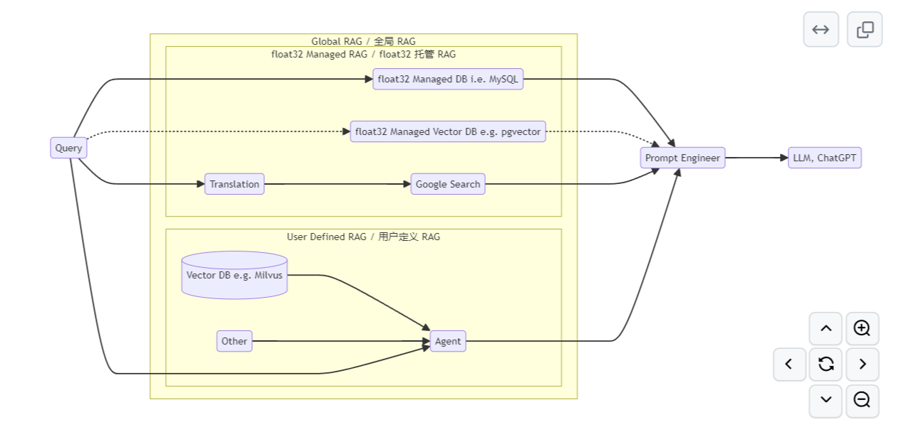
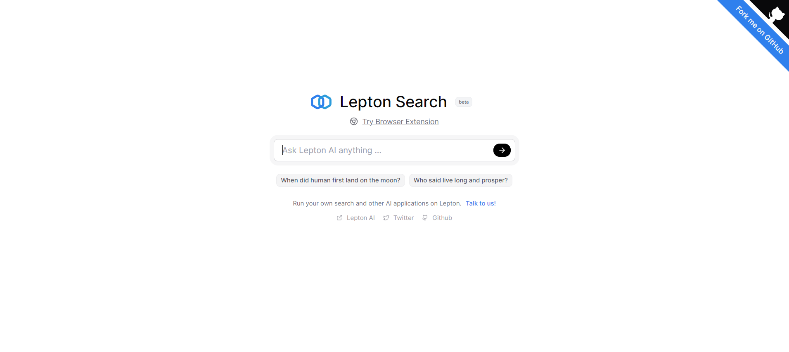
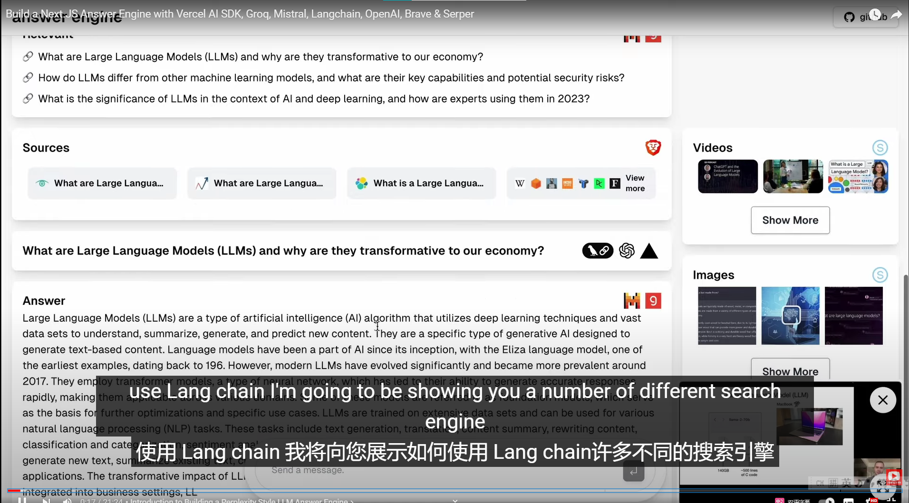
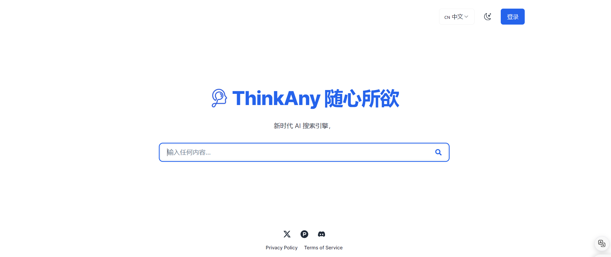

<!--
TBD:
Add to visual:
- Self-operating computer
- Kompas AI
- LLM Stack
- Promptly
- Juno
- Kusho
- Wordware
- Code Autopilot
- GPTDiscord
- Chat Arena
- Code WP
- NoteWizard
- Invicta AI

Add to readme list:
- Rubric
- Codeium
- Semantix AI Agents - add when they have english version
- NoteWizard - only if it's AI agent - TBD test
- Postbot (TBD - check more)

- Suspicion Agent
- Wispy
	-->

<h1 align="center">
	🧐 Awesome Perplexity Alternative
	
</h1>
<h3 align="center">
  Improving the overall performance of the AI system through the RAG approach
</h3>


# Open-source projects

## [clarity-ai](https://github.com/mckaywrigley/clarity-ai)
A simple Perplexity AI clone.


### Description

The repository provides a minimal PPLX implementation in TypeScript, allowing front-end developers to get started with it. It relies on the OpenAI API, but implements RAG by scraping and parsing HTML from Google web pages, rather than using a search engine API.


## [Perplexity-Clone-Python](https://github.com/MasonBarnes/Perplexity-Clone-Python)
A near perfect replica of Perplexity AI's "Search" function in Python.


### Description

This repository is the Python version of clarity-ai, which directly returns an HTML file constructed in a specific format on the front end. If you are a Python developer and do not care about the front-end implementation, this tiny pplx search repository simplifies the backend representation of pplx and is very suitable for learning.

## [float32](https://github.com/MasonBarnes/Perplexity-Clone-Python)
float32.app is a large language model-driven search assistant that can help you quickly find the answers you want. Based on RAG technology, float32 can access internet information to provide more accurate responses.［https://float32.app/］



### Description


#### Server 端

- `float32.app` 支持自托管,你可以在本地搭建一个 `float32.app` 服务。服务相关代码可以参考 `backend/exec/svr/...`

为了能运行,你需要:

- **OpenAI API 服务**
  - 必须。包括 API Key 和 EndPoint（如适用）
- **Serper.dev 服务**
  - 必须。用于获取搜索引擎结果。包括一个 API Key。
- **MySQL 数据库**
  - 可选。用于历史服务,如没有 MySQL 数据库,则历史服务/分享服务不可用。


#### 前端

前端使用 `pnpm + React + Vite + MobX + TDesign` 的结构。请使用以下命令以启动开发服务器:

```bash
cd frontend
bash tdesign.sh # 获取 TDesign 资源
pnpm i
pnpm dev
```

## [search_with_lepton](https://github.com/leptonai/search_with_lepton)
Building a quick conversation-based search demo with Lepton AI.([search.lepton.run](https://search.lepton.run/))





### Description

- Built-in support for LLM
- Built-in support for search engine
- Customizable pretty UI interface
- Shareable, cached search results
The repository is built with TypeScript and Python for the front-end and back-end, it depends on the Lepton third-party package for deployment, and it does not support continuous question-answering.


## [llm-answer-engine](https://github.com/developersdigest/llm-answer-engine)
Build a Perplexity-Inspired Answer Engine Using Next.js, Groq, Mixtral, Langchain, OpenAI, Brave & Serper[https://www.youtube.com/watch?v=kFC-OWw7G8k&feature=youtu.be]




### Description

This repository contains the code and instructions needed to build a sophisticated answer engine that leverages the capabilities of Groq, Mistral AI's Mixtral, Langchain.JS, Brave Search, Serper API, and OpenAI. Designed to efficiently return sources, answers, images, videos, and follow-up questions based on user queries, this project is an ideal starting point for developers interested in natural language processing and search technologies.

#### Technologies Used
- Next.js: A React framework for building server-side rendered and static web applications.
- Tailwind CSS: A utility-first CSS framework for rapidly building custom user interfaces.
- Vercel AI SDK: The Vercel AI SDK is a library for building AI-powered streaming text and chat UIs.
- Groq & Mixtral: Technologies for processing and understanding user queries.
- Langchain.JS: A JavaScript library focused on text operations, such as text splitting and embeddings.
- Brave Search: A privacy-focused search engine used for sourcing relevant content and images.
- Serper API: Used for fetching relevant video and image results based on the user's query.
- OpenAI Embeddings: Used for creating vector representations of text chunks.
- Cheerio: Utilized for HTML parsing, allowing the extraction of content from web pages.
- Ollama (Optional): Used for streaming inference and embeddings.


## [rag-search](https://github.com/thinkany-ai/rag-search)
RAG Search API([thinkany.ai](https://thinkany.ai/))





### Description

rag-search is a backend API of thinkany. If you are a front-end programmer focusing on building web UI, you can directly use the open-source pplx-rag implementation provided by thinkany by integrating this API.